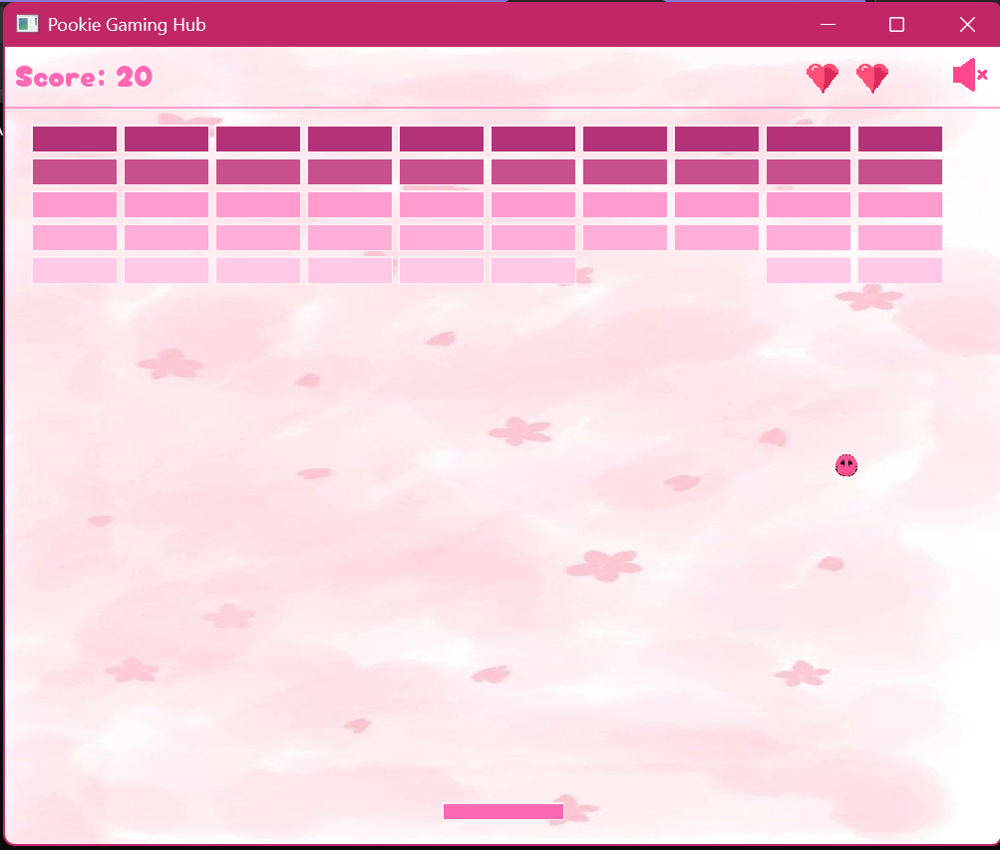
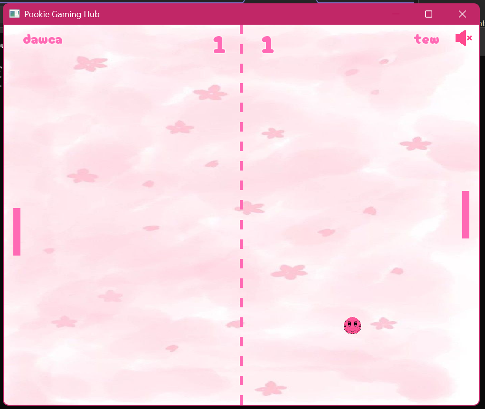
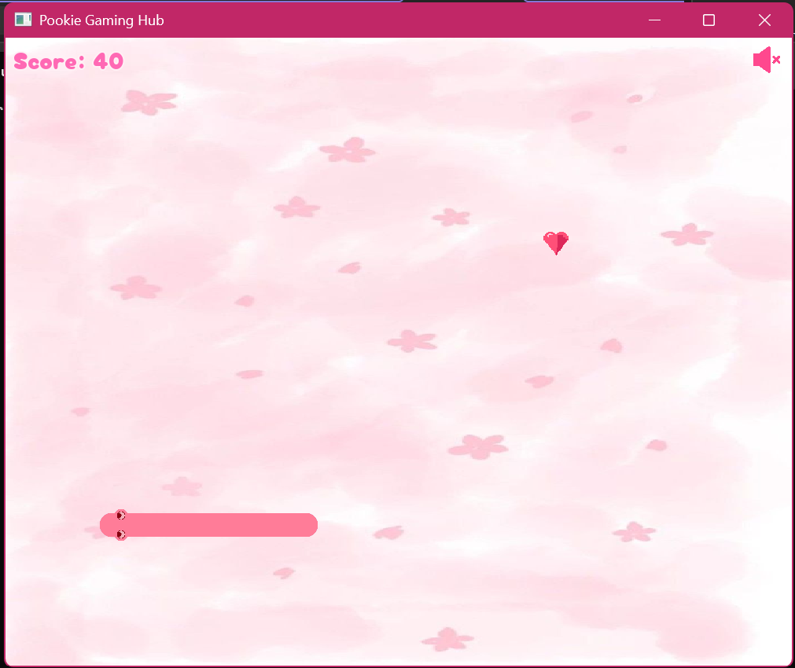

#  Gaming Hub
Gaming Hub is a C++ project built using **SFML 3.0**.

The project combines multiple classic arcade games into a single application where players can choose a game from a central menu and keep track of their scores.

## Games Included
- Ping Pong
- Snake
- Brick Breaker
- Leaderboard

## Screenshots

 

  
  
  

 

## Purpose

This project was created to practice:

- Object-Oriented Programming (OOP)
- Event handling
- Game loops
- Collision detection
- Graphics and audio with SFML
- Organizing a larger C++ project

## Built With

- C++
- SFML 3.0

SFML was used for graphics rendering, user input, audio playback, and window management.

## SFML Dependency

SFML is **not included** in this repository.

To build and run the project, install **SFML 3.0** and configure it in your development environment.

## Note

Although this project started as a university assignment, it became a fun opportunity to experiment with game development, design a cute user interface, and bring multiple classic games together in one place. Have fun, and don't let the cat soundtrack distract you from beating your high score.
